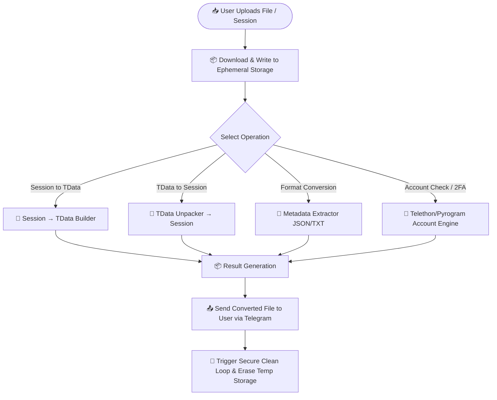
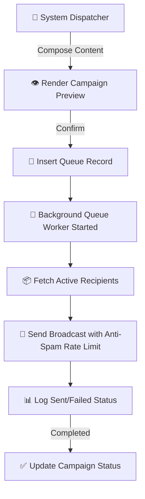

# 🌟 TG Convert FreeBot
### The Most Powerful & Free Telegram Session Management & Format Conversion Tool

  <b>TG Convert FreeBot</b> is a web-scale, asynchronous platform engineered for Telegram session lifecycle management, file format conversion, security auditing, and account utilities. Built for speed, safety, and reliability—completely free of charge with no restrictions.

### 👉 [START USING THE BOT NOW](https://t.me/TG_convert_freeBoT) 👈

---

> [!NOTE]
> **100% Free • No Payment • No VIP • No Restrictions**  
> This bot offers all enterprise features for free. Run conversions, audit security, and manage your files without limits.

---

## 🌐 Supported Languages & Feature Overview

Click on your language below to see the full list of features and capabilities:

<b>🇬🇧 1. English (Features List)</b>

 

* **CHECK:** Verify account sessions (*Session Check*), check for spam restrictions (*Spam Check*), retrieve login codes (*Read OTP*), and verify account contacts (*Check Contacts*).
* **CONVERT:** Convert account formats between different types such as *Session ↔ TData*, *Session ↔ JSON*, and *Account ↔ TXT*.
* **FILE TOOLS:** Tools to split large files (*File Split*) or combine multiple files together (*File Merge*).
* **2FA (Two-Factor Authentication):** Manage security by changing (*2FA Change*), disabling (*2FA Disable*), or resetting passwords (*Reset 2FA*), as well as managing login emails (*Login Email*).
* **CHANNEL & ACCOUNT:** Join or leave channels, clear chats (*Clean Chat*), manage or delete contacts (*Clear/Delete Contact*), set up the user profile (*Profile Setup*), and check how old the account is (*Account Age*).
* **ADVANCED:** Send bulk messages (*Mass Message*), terminate active sessions (*Kill Session*), create new ones (*Fresh Session*), and verify lists (*List Checker*).
* **PRIVACY, VIP & SETTINGS:** Adjust privacy configurations (*Privacy Settings*), purchase premium access (*Buy VIP*), and access Help & Support or change language settings.

<b>🇸🇦 2. Arabic (العربية - قائمة الميزات)</b>

 

* **الفحص (CHECK):** التحقق من جلسات الحساب (*Session Check*)، فحص قيود الحظر/السبام (*Spam Check*)، قراءة رموز التحقق (*Read OTP*)، والتحقق من جهات الاتصال (*Check Contacts*).
* **التحويل (CONVERT):** تحويل بيانات الحساب بين صيغ مختلفة مثل *Session ↔ TData* و *Session ↔ JSON* و *Account ↔ TXT*.
* **أدوات الملفات (FILE TOOLS):** تقسيم الملفات الكبيرة (*File Split*) أو دمج عدة ملفات معاً (*File Merge*).
* **المصادقة الثنائية (2FA):** تغيير رمز التحقق بخطوتين (*2FA Change*)، أو تعطيله (*2FA Disable*)، أو إعادة تعيينه (*Reset 2FA*)، وإدارة البريد الإلكتروني لتسجيل الدخول (*Login Email*).
* **القناة والحساب (CHANNEL & ACCOUNT):** الانضمام أو المغادرة من القنوات، مسح المحادثات (*Clean Chat*)، مسح/حذف جهات الاتصال، إعداد الملف الشخصي (*Profile Setup*)، ومعرفة عمر الحساب (*Account Age*).
* **ميزات متقدمة (ADVANCED):** إرسال رسائل جماعية (*Mass Message*)، إنهاء الجلسات النشطة (*Kill Session*)، إنشاء جلسات جديدة (*Fresh Session*)، وفحص القوائم (*List Checker*).
* **الخصوصية، VIP والإعدادات:** تعديل إعدادات الخصوصية (*Privacy Settings*)، شراء العضوية المميزة (*Buy VIP*)، والوصول إلى قسم المساعدة والدعم.

<b>🇨🇳 3. Chinese (中文 - 功能列表)</b>

 

* **检查功能 (CHECK):** 验证账户会话 (*Session Check*)，检查垃圾邮件限制 (*Spam Check*)，读取一次性验证码 (*Read OTP*)，以及检查联系人 (*Check Contacts*)。
* **格式转换 (CONVERT):** 在不同格式之间转换账户数据，例如 *Session ↔ TData*、*Session ↔ JSON* 和 *Account ↔ TXT*。
* **文件工具 (FILE TOOLS):** 分割大型文件 (*File Split*) 或合并多个文件 (*File Merge*)。
* **双重身份验证 (2FA):** 更改 (*2FA Change*)、禁用 (*2FA Disable*) 或重置双重身份验证 (*Reset 2FA*)，以及管理登录电子邮件 (*Login Email*)。
* **频道与账户 (CHANNEL & ACCOUNT):** 加入或退出频道，清理聊天记录 (*Clean Chat*)，清理/删除联系人，设置个人资料 (*Profile Setup*)，以及查看账户注册时间 (*Account Age*)。
* **高级功能 (ADVANCED):** 群发消息 (*Mass Message*)，强制终止活动会话 (*Kill Session*)，创建新会话 (*Fresh Session*)，以及列表检查器 (*List Checker*)。
* **隐私、VIP 与 设置 (PRIVACY, VIP & SETTINGS):** 调整隐私设置 (*Privacy Settings*)，购买高级 VIP 权限 (*Buy VIP*)，以及获取帮助和支持 (*Help & Support*)。

<b>🇮🇳 4. Hindi (हिन्दी - सुविधाओं की सूची)</b>

 

* **चेक (CHECK):** अकाउंट सेशन को सत्यापित करना (*Session Check*), स्पैम प्रतिबंधों की जांच करना (*Spam Check*), लॉगिन कोड पढ़ना (*Read OTP*), और संपर्कों की जांच करना (*Check Contacts*)।
* **कन्वर्ट (CONVERT):** खाता डेटा को विभिन्न प्रारूपों के बीच बदलना जैसे *Session ↔ TData*, *Session ↔ JSON*, और *Account ↔ TXT*।
* **फ़ाइल टूल (FILE TOOLS):** बड़ी फ़ाइलों को विभाजित करना (*File Split*) या कई फ़ाइलों को एक साथ मिलाना (*File Merge*)।
* **2FA (टू-फैक्टर ऑथेंटिकेशन):** सुरक्षा कोड बदलना (*2FA Change*), अक्षम करना (*2FA Disable*), या रीसेट करना (*Reset 2FA*), और लॉगिन ईमेल प्रबंधित करना (*Login Email*)।
* **चैनल और खाता (CHANNEL & ACCOUNT):** चैनलों से जुड़ना या छोड़ना, चैट साफ़ करना (*Clean Chat*), संपर्कों को प्रबंधित/हटाना, प्रोफ़ाइल सेट करना (*Profile Setup*), और खाते की आयु जाँचना (*Account Age*)।
* **उन्नत (ADVANCED):** सामूहिक संदेश भेजना (*Mass Message*), सक्रिय सेशन को समाप्त करना (*Kill Session*), नए सेशन बनाना (*Fresh Session*), और सूची जांचना (*List Checker*)।
* **गोपनीयता, VIP और सेटिंग्स:** गोपनीयता सेटिंग्स बदलना (*Privacy Settings*), VIP एक्सेस खरीदना (*Buy VIP*), और सहायता/समर्थन प्राप्त करना।

<b>🇵🇰 5. Urdu (اردو - خصوصیات کی فہرست)</b>

 

* **چیک کریں (CHECK):** اکاؤنٹ سیشنز کی تصدیق کرنا (*Session Check*)، سپیم پابندیوں کی جانچ کرنا (*Spam Check*)، لاگ ان کوڈز پڑھنا (*Read OTP*)، اور رابطوں (*Contacts*) کو چیک کرنا۔
* **تبدیل کریں (CONVERT):** اکاؤنٹ کے ڈیٹا کو مختلف فارمیٹس میں تبدیل کرنا جیسے *Session ↔ TData*، *Session ↔ JSON*، اور *Account ↔ TXT*۔
* **فائل ٹولز (FILE TOOLS):** بڑی فائلوں کو حصوں میں تقسیم کرنا (*File Split*) یا متعدد فائلوں کو ملانا (*File Merge*)۔
* **ٹو فیکٹر تصدیق (2FA):** سیکیورٹی کے لیے ٹو فیکٹر تصدیق کو تبدیل کرنا (*2FA Change*)، غیر فعال کرنا (*2FA Disable*)، یا ری سیٹ کرنا (*Reset 2FA*)، اور لاگ ان ای میل کا انتظام کرنا۔
* **چینل اور اکاؤنٹ (CHANNEL & ACCOUNT):** چینلز میں شامل ہونا یا ان کو چھوڑنا، چیٹس کو صاف کرنا (*Clean Chat*)، رابطوں کو حذف/صاف کرنا، پروفائل سیٹ اپ کرنا (*Profile Setup*)، اور اکاؤنٹ کی عمر چیک کرنا (*Account Age*)۔
* **ایڈوانسڈ (ADVANCED):** ایک ساتھ بہت سے پیغامات بھیجنا (*Mass Message*)، فعال سیشنز کو ختم کرنا (*Kill Session*)، نئے سیشنز بنانا (*Fresh Session*)، اور لسٹ چیکر (*List Checker*)۔
* **پرائیویسی، وی آئی پی اور سیٹنگز:** پرائیویسی سیٹنگز کو تبدیل کرنا (*Privacy Settings*)، وی آئی پی رسائی خریدنا (*Buy VIP*)، اور مدد/سپورٹ حاصل کرنا۔

<b>🇧🇩 6. Bengali (বাংলা - বৈশিষ্ট্য তালিকা)</b>

 

* **চেক (CHECK):** অ্যাকাউন্ট সেশন যাচাই করা (*Session Check*), স্প্যাম সীমাবদ্ধতা পরীক্ষা করা (*Spam Check*), লগইন কোড পড়া (*Read OTP*) এবং পরিচিতিগুলি পরীক্ষা করা (*Check Contacts*)।
* **রূপান্তর (CONVERT):** অ্যাকাউন্টের ফর্ম্যাটগুলি বিভিন্ন প্রকারের মধ্যে রূপান্তর করা যেমন *Session ↔ TData*, *Session ↔ JSON*, এবং *Account ↔ TXT*।
* **ফাইল টুলস (FILE TOOLS):** বড় ফাইল বিভক্ত করা (*File Split*) বা একাধিক ফাইল একসাথে যুক্ত করা (*File Merge*)।
* **2FA (টু-ফ্যাক্টর প্রমাণীকরণ):** টু-ফ্যাক্টর প্রমাণীকরণ পরিবর্তন (*2FA Change*), নিষ্ক্রিয় (*2FA Disable*) বা রিসেট করা (*Reset 2FA*) এবং লগইন ইমেল পরিচালনা করা (*Login Email*)।
* **চ্যানেল এবং অ্যাকাউন্ট (CHANNEL & ACCOUNT):** চ্যানেলে যোগদান করা বা ত্যাগ করা, চ্যাট পরিষ্কার করা (*Clean Chat*), পরিচিতিগুলি মুছুন/পরিষ্কার করা, ব্যবহারকারীর প্রোফাইল সেট আপ করা (*Profile Setup*) এবং অ্যাকাউন্টের বয়স যাচাই করা (*Account Age*)।
* **উন্নত (ADVANCED):** বাল্ক বা গণ বার্তা পাঠানো (*Mass Message*), সক্রিয় সেশনগুলি বন্ধ করা (*Kill Session*), নতুন সেশন তৈরি করা (*Fresh Session*) এবং তালিকা পরীক্ষা করা (*List Checker*)।
* **গোপনীয়তা, ভিআইপি এবং সেটিংস:** গোপনীয়তা কনফিগারেশন সামঞ্জস্য করা (*Privacy Settings*), প্রিমিয়াম অ্যাক্সেস কেনা (*Buy VIP*) এবং সহায়তা/সমর্থন (*Help & Support*) অ্যাক্সেস করা।

---

## 📊 System Architecture & Operation Flow

Under the hood, **TG Convert FreeBot** utilizes a production-grade asynchronous architecture to handle conversions instantly:

### 📢 Advanced Broadcast Dispatch Flow
Features automatic queue dispatch with rate-limiting protection:

---

## 🔒 Security & Privacy First

1. **Ephemeral File System**: Temporary folders and uploaded `.session`/`TData` archives are automatically erased via background clean loops every 5 minutes.
2. **Fernet AES-128 Encryption**: All proxy information and connection tokens are encrypted at rest using industry-standard AES encryption.
3. **Session Isolation**: Every connection operates in a separate process container to guarantee absolute data privacy.

---

## 🚀 Get Started

1. Open Telegram and search for **[@TG_convert_freeBoT](https://t.me/TG_convert_freeBoT)**.
2. Send `/start` and select your preferred language.
3. Upload your session file or archive and start converting!

---

<b>🔍 Hashtags & SEO Keywords</b>

 

#TelegramBot #FreeBot #TelegramTools #TelegramTips #TelegramHacks #FreeTelegram #TelegramChannel #TelegramMarketing #SocialMediaTips #DigitalTools #ProductivityHack #TechTools #FreeTools #BotFree #Telegram2026 #Viral #Trending #MustHave #GameChanger #LifeHack #TechHacks #بوت_تلجرام #تلجرام #تليجرام #مجاني #بوتات_مجانية #تكنولوجيا #أدوات_تلجرام #شروحات #شرح_تلجرام #تيليجرام_العرب #عالم_التقنية #تطبيقات #خدمات_مجانية #انستقرام #تويتر #تيك_توك #محتوى #ترند #Telegram教程 #电报 #电报群 #Telegram群组 #免费工具 #免费软件 #实用工具 #神器推荐 #涨粉技巧 #营销工具 #网络工具 #黑客工具 #科技分享 #数码科技 #玩转电报 #电报机器人 #中文电报 #全球电报 #TelegramBot #फ्रीबॉट #TelegramTips #फ्रीटूल्स #टेलीग्राम #टेक्नोलॉजी #डिजिटलमार्केटिंग #सोशलमीडिया #वायरल #ट्रेंडिंग #ऑनलाइनटूल्स #मोबाइलटिप्स #इंटरनेटटिप्स #हिंदी #गैजेट्स #ٹیلیگرام #فری_بوٹ #ٹیلیگرام_ٹپس #فری_ٹولز #ٹیکنالوجی #سوشل_میڈیا #ڈیجیٹل_مارکیٹنگ #آنلائن #ٹرینڈنگ #وائرل #پاکستان #اردو #مفت #ٹولز #ٹیک #ٹپس #টেলিগ্রাম #ফ্রিবট #টেলিগ্রামটিপস #ফ্রিটুলস #প্রযুক্তি #সোশ্যালমিডিয়া #ডিজিটালমার্কেটিং #ট্রেন্ডিং #ভাইরাল #বাংলাদেশ #অনলাইন #টেক #টিপস #মোবাইল #গ্যাজেট #TGConvertFreeBot #FreeTelegramBot #TelegramConvert #SessionToTdata #TelegramTools #FreeConvert #TelegramHacks2026 #BotFreeForAll #TelegramVIP #TelegramPremium #TelegramStars

---

  Developed with ❤️ for high-performance Telegram automations.

