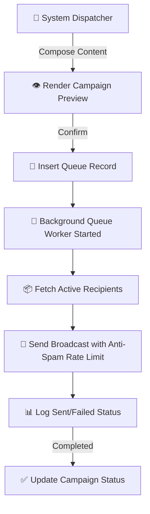

# 🌟 TG Convert FreeBot
### The Most Powerful & Free Telegram Session Management & Format Conversion Tool

  <b>TG Convert FreeBot</b> is a web-scale, asynchronous platform engineered for Telegram session lifecycle management, file format conversion, security auditing, and account utilities. Built for speed, safety, and reliability—completely free of charge with no restrictions.

[👉 START USING THE BOT NOW](https://t.me/TG_convert_freeBoT)

---

> [!NOTE]
> **100% Free • No Payment • No VIP • No Restrictions**  
> This bot offers all enterprise features for free. Run conversions, audit security, and manage your files without limits.

---

## 🔹 What You Get For Free

### 🔄 Format Conversion
- **Session ↔️ TData**: Seamless bidirectional conversion between Telethon/Pyrogram `.session` files and Telegram Desktop `TData` folders.
- **Session ↔️ JSON ↔️ TXT**: Fast extraction of session keys, app configuration details, and proxy parameters into plain JSON or TXT formats.

### ✔️ Account Checking & Security
- **Session & Spam Check**: Instantly scan accounts for spam blocks, limitations, or restrictions.
- **OTP & Contacts Reader**: Access active OTP codes and retrieve account contact lists securely.
- **2FA Management**: Set, update, or safely reset your Two-Factor Authentication passwords.

### 📂 File Tools & Management
- **Split & Merge**: Split massive archive zip packs or merge multiple session configurations into single files.
- **Account Setup & Cleanup**: Clean up temporary files, reset session parameters, and configure active privacy levels.
- **Privacy Settings**: Review and adjust target session privacy options (Active Sessions, Call History, and Info visibility).

### 🚀 Advanced Campaign Utilities
- **Mass Message Sender**: Send broadcast campaigns or forwarding messages to target audiences.
- **Sessions & List Checker**: Batch check a large list of sessions for live connectivity status.

---

## 📊 System Architecture & Operation Flow

Under the hood, **TG Convert FreeBot** utilizes a production-grade asynchronous architecture to handle conversions instantly:

### 📢 Advanced Broadcast Dispatch Flow
Features automatic queue dispatch with rate-limiting protection:

---

## 🔒 Security & Privacy First

1. **Ephemeral File System**: Temporary folders and uploaded `.session`/`TData` archives are automatically erased via background clean loops every 5 minutes.
2. ** Fernet AES-128 Encryption**: All proxy information and connection tokens are encrypted at rest using industry-standard AES encryption.
3. **Session Isolation**: Every connection operates in a separate process container to guarantee absolute data privacy.

---

## 🌐 Supported Languages

The bot natively supports **6 major languages** across all user menus and interaction buttons:

| Code | Flag | Language Name |
|---|---|---|
| `en` | 🇬🇧 | English |
| `bn` | 🇧🇩 | বাংলা (Bengali) |
| `hi` | 🇮🇳 | हिन्दी (Hindi) |
| `ur` | 🇵🇰 | اردو (Urdu) |
| `ar` | 🇸🇦 | العربية (Arabic) |
| `zh` | 🇨🇳 | 中文 (Chinese) |

---

## 🚀 Get Started

1. Open Telegram and search for **[@TG_convert_freeBoT](https://t.me/TG_convert_freeBoT)**.
2. Send `/start` and select your preferred language.
3. Upload your session file or archive and start converting!

---

  Developed with ❤️ for high-performance Telegram automations.

